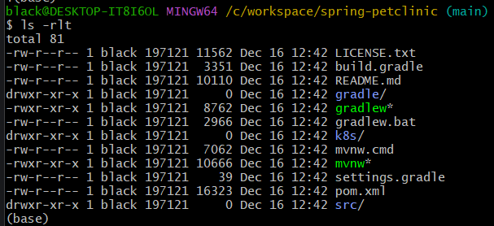
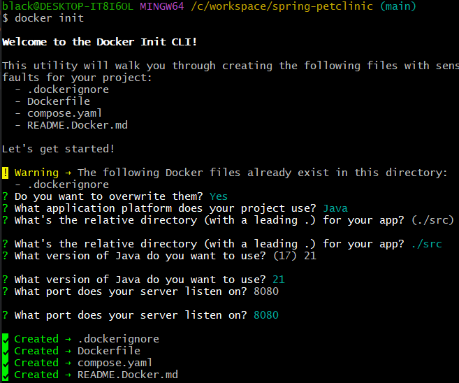
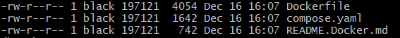
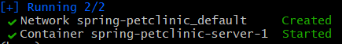
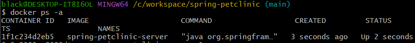
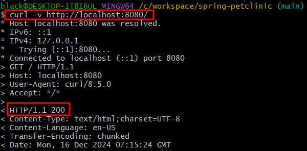
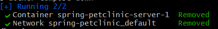
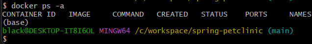

#  Java_Application_컨테이너에_올리기

## git clone 리파지토리

- git clone https://github.com/spring-projects/spring-petclinic.git
- 

## docker 에셋 생성

- docker init
- ? Do you want to overwrite them? Yes
- ? What application platform does your project use? Java
- ? What's the relative directory (with a leading .) for your app? (./src)
- ? What version of Java do you want to use? 21
- ? What port does your server listen on? 8080
- 
- 

## 컨테이너 올리기

- docker compose up --build -d
- 
- 
- 

## 컨테이너 내리기

- docker compose down
- 
- 