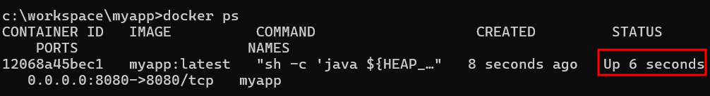
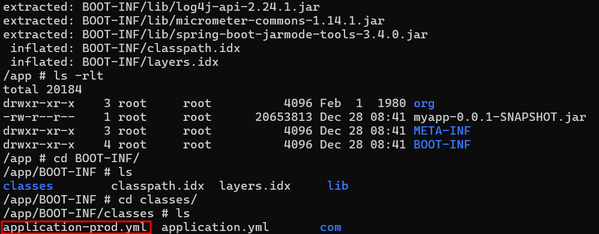
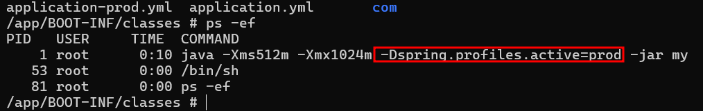
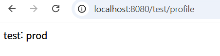

# docker : Dockerfile Profile 설정

## given

```
# stage build
FROM gradle:8.11-jdk17 as builder

ARG PROFILE="local"
ENV GRADLE_PROFILE=${PROFILE}

WORKDIR /app

COPY build.gradle settings.gradle ./
RUN gradle build -x test --parallel --continue > /dev/null 2>&1 || true

COPY . ./
RUN gradle build -x test --parallel -P profile=${GRADLE_PROFILE}

# stage run
FROM openjdk:17-alpine

ARG PROFILE="local"
ENV SPRING_PROFILE=${PROFILE}
ENV HEAP_MEMORY_SIZE="-Xms512m -Xmx1024m"
EXPOSE 8080

WORKDIR /app

COPY --from=builder /app/build/libs/myapp-*-SNAPSHOT.jar .

ENTRYPOINT ["sh", "-c", "java ${HEAP_MEMORY_SIZE} -Dspring.profiles.active=${SPRING_PROFILE} -jar myapp-*-SNAPSHOT.jar"]
```

## when

### 컨테이너 실행

```
docker build --build-arg PROFILE=prod -t myapp:latest .
docker run -d -p 8080:8080 --name myapp myapp:latest
```

### jar 내부 프로파일 리소스 확인

```
docker exec -it myapp /bin/sh
jar -xvf *.jar
```

### 프로세스 실행 명령어 확인

```
ps -ef
```

## then

### 컨테이너 실행



### jar 내부 프로파일 리소스 확인



### 프로세스 실행 명령어 확인



